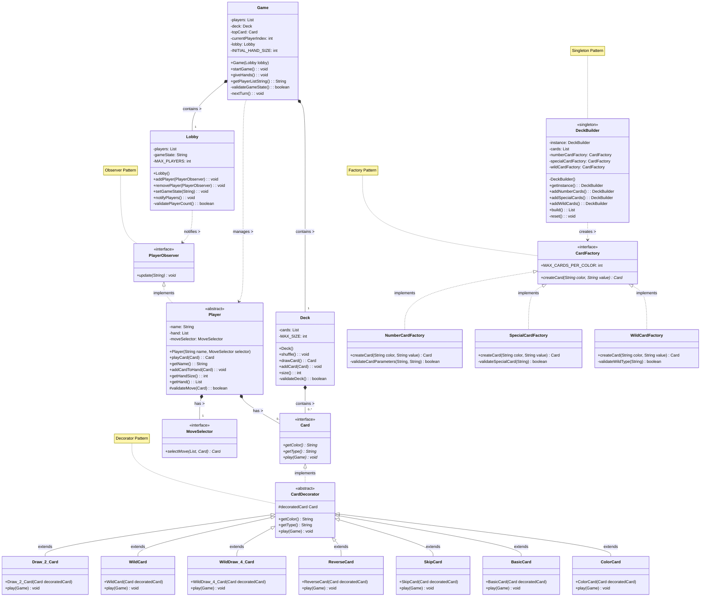

```mermaid

classDiagram
    class Card {
        <<interface>>
        +getColor()* String
        +getType()* String
        +play(Game)* void
    }

    class CardDecorator {
        <<abstract>>
        #decoratedCard Card
        +getColor() String
        +getType() String
        +play(Game) void
    }

    class Draw_2_Card {
        +Draw_2_Card(Card decoratedCard)
        +play(Game) void
    }
    class WildCard {
        +WildCard(Card decoratedCard)
        +play(Game) void
    }
    class WildDraw_4_Card {
        +WildDraw_4_Card(Card decoratedCard)
        +play(Game) void
    }
    class ReverseCard {
        +ReverseCard(Card decoratedCard)
        +play(Game) void
    }
    class SkipCard {
        +SkipCard(Card decoratedCard)
        +play(Game) void
    }
    class BasicCard {
        +BasicCard(Card decoratedCard)
        +play(Game) void
    }
    class ColorCard {
        +ColorCard(Card decoratedCard)
        +play(Game) void
    }

    class Player {
        <<abstract>>
        -name: String
        -hand: List<Card>
        -moveSelector: MoveSelector
        +Player(String name, MoveSelector selector)
        +playCard(Card): Card
        +getName(): String
        +addCardToHand(Card): void
        +getHandSize(): int
        +getHand(): List<Card>
        #validateMove(Card): boolean
    }

    class Deck {
        -cards: List<Card>
        -MAX_SIZE: int
        +Deck()
        +shuffle(): void
        +drawCard(): Card
        +addCard(Card): void
        +size(): int
        -validateDeck(): boolean
    }

    class DeckBuilder {
        <<singleton>>
        -instance: DeckBuilder
        -cards: List<Card>
        -numberCardFactory: CardFactory
        -specialCardFactory: CardFactory
        -wildCardFactory: CardFactory
        -DeckBuilder()
        +getInstance(): DeckBuilder
        +addNumberCards(): DeckBuilder
        +addSpecialCards(): DeckBuilder
        +addWildCards(): DeckBuilder
        +build(): List<Card>
        -reset(): void
    }

    class Game {
        -players: List<Player>
        -deck: Deck
        -topCard: Card
        -currentPlayerIndex: int
        -lobby: Lobby
        -INITIAL_HAND_SIZE: int
        +Game(Lobby lobby)
        +startGame(): void
        +giveHands(): void
        +getPlayerListString(): String
        -validateGameState(): boolean
        -nextTurn(): void
    }

    class Lobby {
        -players: List<PlayerObserver>
        -gameState: String
        -MAX_PLAYERS: int
        +Lobby()
        +addPlayer(PlayerObserver): void
        +removePlayer(PlayerObserver): void
        +setGameState(String): void
        +notifyPlayers(): void
        -validatePlayerCount(): boolean
    }

    class PlayerObserver {
        <<interface>>
        +update(String)* void
    }

    class MoveSelector {
        <<interface>>
        +selectMove(List<Card>, Card)* Card
    }

    class CardFactory {
        <<interface>>
        +createCard(String color, String value)* Card
        +MAX_CARDS_PER_COLOR: int
    }

    class NumberCardFactory {
        +createCard(String color, String value) Card
        -validateCardParameters(String, String) boolean
    }
    class SpecialCardFactory {
        +createCard(String color, String value) Card
        -validateSpecialCard(String) boolean
    }
    class WildCardFactory {
        +createCard(String color, String value) Card
        -validateWildType(String) boolean
    }

    %% Inheritance relationships
    Card <|.. CardDecorator : implements
    CardDecorator <|-- Draw_2_Card : extends
    CardDecorator <|-- WildCard : extends
    CardDecorator <|-- WildDraw_4_Card : extends
    CardDecorator <|-- ReverseCard : extends
    CardDecorator <|-- SkipCard : extends
    CardDecorator <|-- BasicCard : extends
    CardDecorator <|-- ColorCard : extends
    PlayerObserver <|.. Player : implements
    CardFactory <|.. NumberCardFactory : implements
    CardFactory <|.. SpecialCardFactory : implements
    CardFactory <|.. WildCardFactory : implements

    %% Composition relationships
    Game *-- "1" Deck : contains >
    Game *-- "1" Lobby : contains >
    Player *-- "0..*" Card : has >
    Deck *-- "0..*" Card : contains >
    Player *-- "1" MoveSelector : has >

    %% Dependencies
    DeckBuilder ..> CardFactory : creates >
    Game ..> Player : manages >
    Lobby ..> PlayerObserver : notifies >

    %% Notes
    note for DeckBuilder "Singleton Pattern"
    note for CardDecorator "Decorator Pattern"
    note for CardFactory "Factory Pattern"
    note for PlayerObserver "Observer Pattern"

```